# Logic App to archive new data

**Produced by Dave Lusty**

## Introduction

This demo shows how to programmatically move data immediately to archive tier when it's ingested into a storage account. The video is [here](https://youtu.be/uku7HN4zaDc)

## Storage Account

Log into the Azure portal and create a new storage account using either Blob or ADLSg2 (Hierarchies) profile. Both will work with this Logic App. Once created, make a new container and name it Incoming. Ensure you use the hot tier since we'll be moving immediately to archive and cool would incur an early deletion charge of 30 days storage. Archive storage has a minimum of 180 days and incurs similar early deletion charges. This is explained in the [FAQ](https://azure.microsoft.com/en-gb/pricing/details/storage/blobs/)

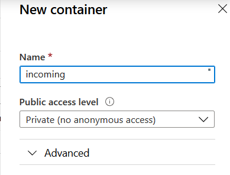

This container will be the location we monitor for new files. If you have hierarchies (folders) these will also be monitored if below the container.

## Logic App

In order to support hierarchies we can't simply use the new Blob trigger since it doesn't support them. As such we need to use the Event Grid trigger instead which will trigger for all new objects regardless of location. We then need to pull out the object location and use that to address the object directly.

Create a new Logic App in the same resource group as your storage account.

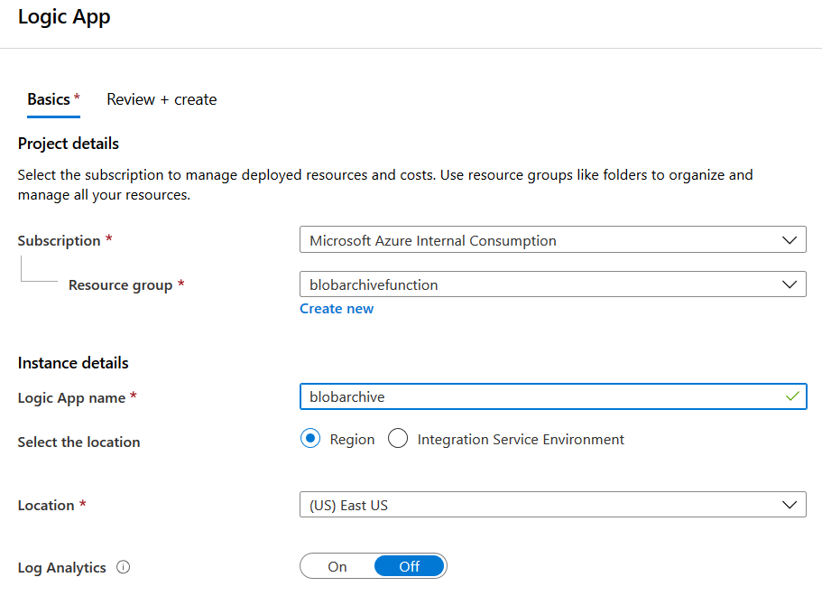

Once this is created, go to the Logic App designer and start a blank app.

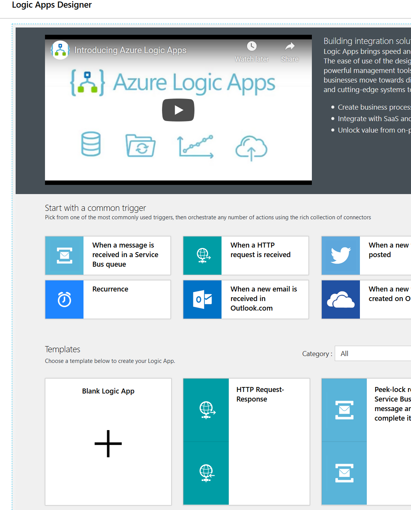

Add an Event Grid trigger for when a resource event occurs.

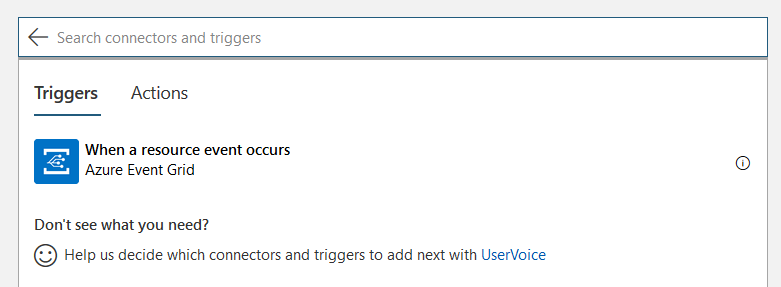

Configure this trigger to your subscription, a type of Microsoft.Storage.StorageAccounts, and the storage account you created above. Select Event Type as Microsoft.Storage.BlobCreated.

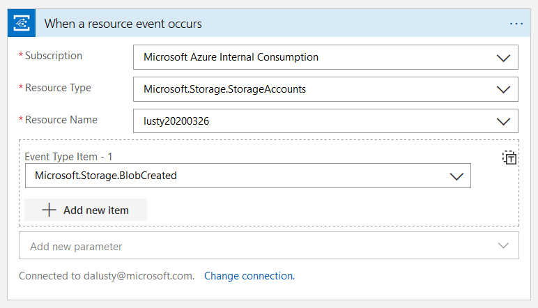

Save the app and click Run. Open your blob storage in another window and upload a file to trigger the app and create an event. We need the body of this to generate a schema for the next step. Expand the box to copy the Body, which will look like the following (I've replaced some parts with dummy data):

```JSON
{
  "topic": "/subscriptions/45325453535353542423/resourceGroups/blobarchivefunction/providers/Microsoft.Storage/storageAccounts/lusty20200326",
  "subject": "/blobServices/default/containers/incoming/blobs/MSLogo Square.png",
  "eventType": "Microsoft.Storage.BlobCreated",
  "eventTime": "2020-03-27T09:44:32.1654679Z",
  "id": "33333333a-3333-0032-333c-333333333333",
  "data": {
    "api": "PutBlob",
    "clientRequestId": "33333333a-3333-0032-333c-333333333333",
    "requestId": "33333333a-3333-0032-333c-333333333333",
    "eTag": "0x8D7D23373A5F259",
    "contentType": "image/png",
    "contentLength": 2897,
    "blobType": "BlockBlob",
    "url": "https://lusty20200326.blob.core.windows.net/incoming/MSLogo Square.png",
    "sequencer": "000000000000000000000000000001290000000000000936",
    "storageDiagnostics": {
      "batchId": "33333333a-3333-0032-333c-333333333333"
    }
  },
  "dataVersion": "",
  "metadataVersion": "1"
}
```

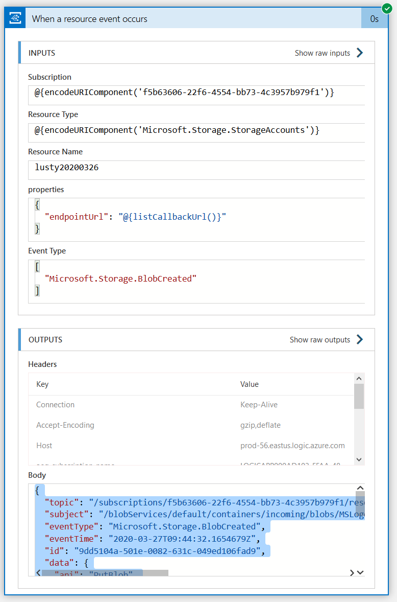

Go back to the designer view and click to add a new step and select Data Operations, Parse JSON.

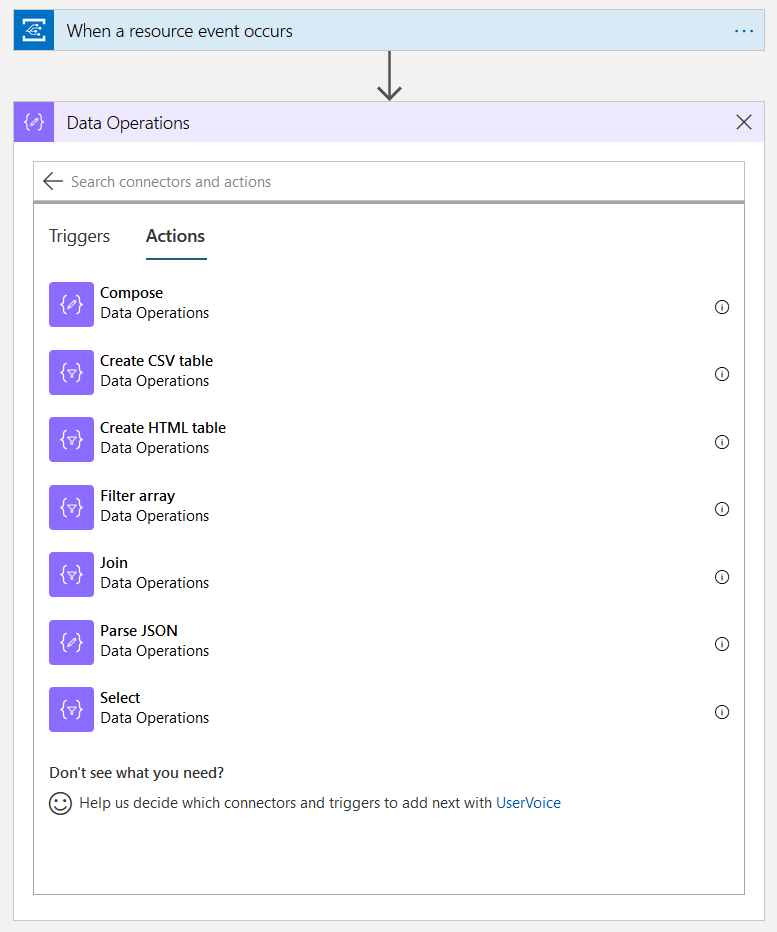

Click "Usa sample payload to generate Schema" and paste in the body text you copied above.

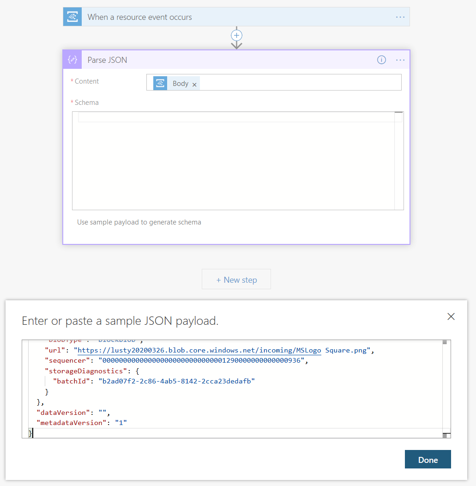

Click Done and then add a new task after the parse task. Add an Azure Blob Storage, Set blob tier by path task.

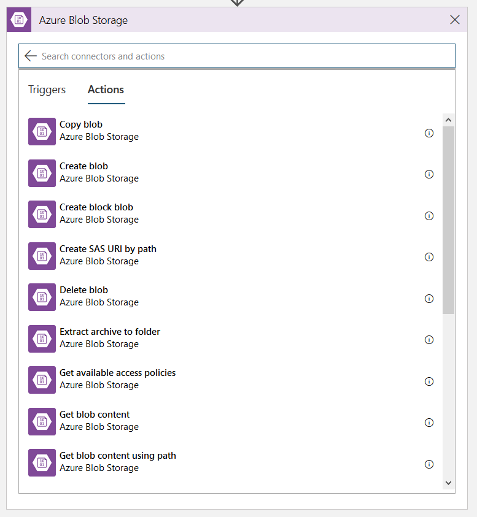

Once you set up the connection to your blob storage, in the Blob path click add dynamic content. In the dialog that pops up, select expression and find substring. Next, go to the dynamic content tab and add the url from the parse JSON task as the first parameter to the function, and then a number for the second. That number will be the number of characters we need to strip from the url line. Mine is "https://lusty20200326.blob.core.windows.net/incoming/MSLogo Square.png" in this example, so I need to enter 44 to leave "incoming/MSLogo Square.png". You'll then end up with an expression like `substring(body('Parse_JSON')?['data']?['url'], 44)`.

Finally, set the Blob Tier to archive and save the app.

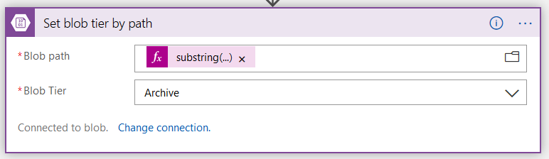

Finally, upload a file to your storage account and then hit refresh and you should see it already changed to archive.

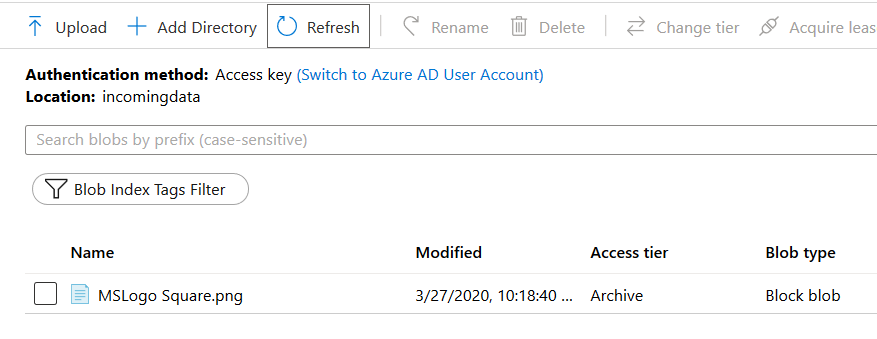